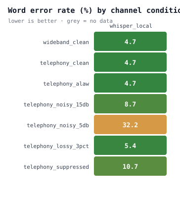

# Telephony ASR benchmark

_12 utterances &#183; 7 channel conditions &#183; 1 providers &#183; 84 cells &#183; $0.00 spent_

Text normalisation: `lowercase, strip_punctuation, expand_contractions, spell_out_numbers, collapse_whitespace`. Prices last checked 2026-09-05.


## Headline

| provider | clean WER | telephony WER | degradation | median RTF |
|---|---|---|---|---|
| whisper_local | 4.7 | 4.7 | 1.0x worse | 0.11 |


> The degradation column is the number worth arguing about. A provider that looks strong on clean wideband audio and loses half of it on an 8 kHz line is not the provider you want answering your phone.


## By channel condition

| condition | whisper_local WER (95% CI) |
|---|---|
| wideband_clean | 4.7 (0.0&ndash;10.5) |
| telephony_clean | 4.7 (0.0&ndash;10.5) |
| telephony_alaw | 4.7 (0.0&ndash;10.5) |
| telephony_noisy_15db | 8.7 (3.2&ndash;16.3) |
| telephony_noisy_5db | 32.2 (17.9&ndash;45.7) |
| telephony_lossy_3pct | 5.4 (0.0&ndash;12.3) |
| telephony_suppressed | 10.7 (4.1&ndash;18.8) |


> Intervals are bootstrapped over utterances. On a set this size they are wide, and two conditions whose intervals overlap have not been shown to differ. Quoting a WER without one is how benchmark claims stop being falsifiable.





## By accent

| accent | whisper_local |
|---|---|
| sapi_david | 16.2 |
| sapi_david_slow | 0.8 |
| sapi_zira | 10.7 |
| sapi_zira_fast | 12.2 |


## By domain

| domain | whisper_local |
|---|---|
| clinical | 12.8 |
| food_order | 7.9 |
| insurance | 9.7 |


## Failure mode

| provider | substitutions | deletions | insertions | read |
|---|---|---|---|---|
| whisper_local | 80 | 19 | 7 | mishears |


> Insertions matter out of proportion to their count. A model that invents words on silence will happily book an appointment nobody asked for.


## Reproducing this

```bash
pip install -e .
tabench run --manifest <manifest.json> --providers whisper_local --max-cost 5.00
tabench report --results out/results.json
```
